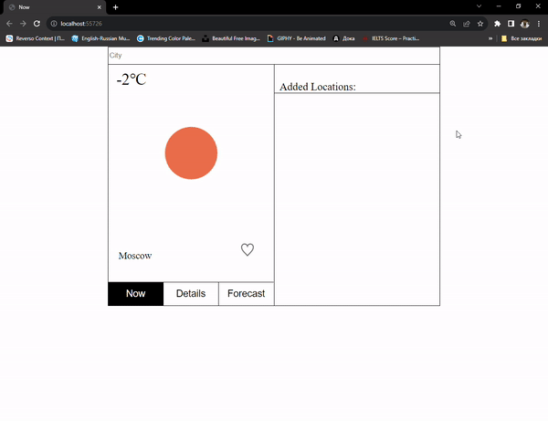

# WeatherApp on Vanilla JS

<a href='https://6538afb374b30b63a783e602--celadon-dango-640a3d.netlify.app/'>Weather App Demo</a>

This app is used for showing the Weather Forecast based on the found city.

It uses the following API: <a href='https://openweathermap.org/'>open weather</a>

## Interface
The page is divided into two columns: first one contains the tabs and second contains the list of added cities.

There are three main tabs
<ul>
    <li>Now: shows the current city and its forecast with the button heart, which adds the city to the city list</li>
    <li>Details: shows more detailed forecast on the current city</li>
    <li>Forecast: depicts 3 hour-forecast</li>
</ul>